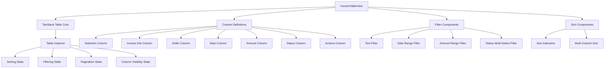

# 发票管理表格排序筛选功能设计文档

## 概述

本设计文档描述了使用 TanStack Table 重构发票管理页面表格的技术方案。TanStack Table 是一个功能强大的无头表格库，提供了排序、筛选、分页等核心功能，同时保持与现有 DaisyUI 样式系统的完美兼容。

### 核心目标
- 使用 TanStack Table 替换现有的简单 HTML 表格
- 实现强大的排序和筛选功能
- 保持现有的 DaisyUI 样式和响应式设计
- 提供优秀的用户体验和性能

## 架构设计

### 整体架构



### 技术栈
- **TanStack Table v8**: 核心表格功能
- **React 19**: UI 框架
- **TypeScript**: 类型安全
- **DaisyUI**: 样式系统
- **Tailwind CSS**: 样式工具
- **Lucide React**: 图标库

## 组件设计

### 1. 主表格组件 (InvoiceTableView)

```typescript
interface InvoiceTableViewProps {
  invoices: Invoice[];
  selectedInvoices: string[];
  onSelectInvoice: (invoiceId: string) => void;
  onSelectAll: (invoiceIds: string[]) => void;
  onViewInvoice: (invoiceId: string) => void;
  onEditInvoice: (invoice: Invoice) => void;
  onDeleteInvoice: (invoice: Invoice) => void;
  onBulkAction: (action: string, invoiceIds: string[]) => void;
  isLoading?: boolean;
}
```

**职责：**
- 管理表格的整体状态
- 协调各个子组件
- 处理用户交互事件
- 维护响应式布局

### 2. 列定义 (Column Definitions)

每个列都将使用 TanStack Table 的列定义格式：

```typescript
const columnDefs: ColumnDef<Invoice>[] = [
  // 选择列
  {
    id: 'select',
    header: ({ table }) => <SelectAllCheckbox table={table} />,
    cell: ({ row }) => <SelectRowCheckbox row={row} />,
    enableSorting: false,
    enableColumnFilter: false,
  },
  // 发票信息列
  {
    accessorKey: 'invoice_number',
    header: '发票信息',
    cell: ({ row }) => <InvoiceInfoCell invoice={row.original} />,
    enableSorting: true,
    enableColumnFilter: true,
    filterFn: 'includesString',
  },
  // 其他列...
];
```

### 3. 筛选组件

#### 3.1 全局搜索组件 (GlobalSearchFilter)
```typescript
interface GlobalSearchFilterProps {
  value: string;
  onChange: (value: string) => void;
  placeholder?: string;
}
```

#### 3.2 列筛选组件 (ColumnFilter)
```typescript
interface ColumnFilterProps {
  column: Column<Invoice>;
  filterType: 'text' | 'date-range' | 'amount-range' | 'multi-select';
}
```

#### 3.3 日期范围筛选器 (DateRangeFilter)
```typescript
interface DateRangeFilterProps {
  value: [Date | null, Date | null];
  onChange: (range: [Date | null, Date | null]) => void;
}
```

#### 3.4 金额范围筛选器 (AmountRangeFilter)
```typescript
interface AmountRangeFilterProps {
  value: [number | null, number | null];
  onChange: (range: [number | null, number | null]) => void;
}
```

#### 3.5 状态多选筛选器 (StatusMultiSelectFilter)
```typescript
interface StatusMultiSelectFilterProps {
  value: string[];
  onChange: (statuses: string[]) => void;
  options: { value: string; label: string }[];
}
```

### 4. 排序组件

#### 4.1 排序指示器 (SortIndicator)
```typescript
interface SortIndicatorProps {
  direction: 'asc' | 'desc' | false;
  canSort: boolean;
}
```

### 5. 分页组件 (TablePagination)

```typescript
interface TablePaginationProps {
  table: Table<Invoice>;
  totalCount: number;
}
```

### 6. 列可见性管理 (ColumnVisibilityManager)

```typescript
interface ColumnVisibilityManagerProps {
  table: Table<Invoice>;
  onVisibilityChange: (columnId: string, visible: boolean) => void;
}
```

## 数据模型

### Invoice 接口扩展

```typescript
interface Invoice {
  id: string;
  invoice_number: string;
  invoice_date: string;
  consumption_date?: string;
  seller_name: string;
  buyer_name: string;
  total_amount: number;
  status: 'draft' | 'pending' | 'completed' | 'failed';
  processing_status: string;
  source: string;
  invoice_type?: string;
  created_at: string;
  tags: string[];
  extracted_data?: {
    structured_data?: {
      total_amount?: string;
      [key: string]: any;
    };
    [key: string]: any;
  };
}
```

### 表格状态管理

```typescript
interface TableState {
  sorting: SortingState;
  columnFilters: ColumnFiltersState;
  globalFilter: string;
  pagination: PaginationState;
  columnVisibility: VisibilityState;
  rowSelection: RowSelectionState;
}
```

## 接口设计

### 1. 筛选接口

```typescript
interface FilterConfig {
  columnId: string;
  filterType: 'text' | 'date-range' | 'amount-range' | 'multi-select';
  value: any;
}

interface FilterState {
  global: string;
  columns: FilterConfig[];
}
```

### 2. 排序接口

```typescript
interface SortConfig {
  id: string;
  desc: boolean;
}

interface SortState {
  sorting: SortConfig[];
}
```

### 3. 分页接口

```typescript
interface PaginationConfig {
  pageIndex: number;
  pageSize: number;
}

interface PaginationInfo {
  totalRows: number;
  totalPages: number;
  currentPage: number;
  pageSize: number;
  hasNextPage: boolean;
  hasPreviousPage: boolean;
}
```

## 错误处理

### 1. 数据加载错误
- 显示友好的错误消息
- 提供重试机制
- 保持表格结构完整

### 2. 筛选错误
- 验证筛选条件的有效性
- 处理无效的日期范围
- 处理无效的数值范围

### 3. 排序错误
- 处理无法排序的数据类型
- 提供降级方案

### 4. 性能错误
- 监控表格渲染性能
- 实现虚拟滚动（如需要）
- 优化大数据集的处理

## 测试策略

### 1. 单元测试
- 测试各个组件的独立功能
- 测试筛选逻辑的正确性
- 测试排序逻辑的正确性
- 测试分页计算的准确性

### 2. 集成测试
- 测试组件间的交互
- 测试状态管理的一致性
- 测试用户操作流程

### 3. 端到端测试
- 测试完整的用户场景
- 测试响应式设计
- 测试性能表现

### 4. 可访问性测试
- 键盘导航支持
- 屏幕阅读器兼容性
- ARIA 标签正确性

## 性能优化

### 1. 渲染优化
- 使用 React.memo 优化组件重渲染
- 实现虚拟滚动（处理大数据集）
- 优化列渲染性能

### 2. 状态管理优化
- 使用 TanStack Table 内置的状态管理
- 避免不必要的状态更新
- 实现状态持久化

### 3. 数据处理优化
- 客户端筛选和排序优化
- 分页数据懒加载
- 缓存筛选结果

### 4. 内存管理
- 及时清理事件监听器
- 避免内存泄漏
- 优化大对象的处理

## 样式设计

### 1. DaisyUI 集成
保持现有的 DaisyUI 样式类：
- `table`: 基础表格样式
- `table-zebra`: 斑马纹效果
- `table-sm`: 紧凑模式
- `btn`: 按钮样式
- `badge`: 状态标签样式

### 2. 自定义样式
```css
.invoice-table {
  @apply table table-zebra w-full;
}

.invoice-table-header {
  @apply bg-base-200;
}

.sort-indicator {
  @apply inline-flex items-center ml-1;
}

.filter-active {
  @apply text-primary;
}

.column-filter-dropdown {
  @apply dropdown dropdown-end;
}
```

### 3. 响应式设计
- 桌面端：完整表格视图
- 平板端：调整列宽和间距
- 移动端：自动切换到卡片视图

## 安全考虑

### 1. 数据验证
- 验证筛选输入的安全性
- 防止 XSS 攻击
- 验证排序参数

### 2. 权限控制
- 基于用户角色的列可见性
- 操作权限验证
- 敏感数据保护

## 部署和维护

### 1. 依赖管理
需要添加的新依赖：
```json
{
  "@tanstack/react-table": "^8.11.0",
  "date-fns": "^3.0.0"
}
```

### 2. 向后兼容性
- 保持现有 API 接口不变
- 渐进式迁移策略
- 提供降级方案

### 3. 监控和日志
- 性能监控
- 错误日志记录
- 用户行为分析

## 实现阶段

### 阶段 1：基础表格结构
- 安装和配置 TanStack Table
- 创建基础表格组件
- 实现列定义

### 阶段 2：排序功能
- 实现列排序
- 添加排序指示器
- 测试排序逻辑

### 阶段 3：筛选功能
- 实现全局搜索
- 实现列筛选
- 添加筛选 UI 组件

### 阶段 4：高级功能
- 实现分页
- 添加列可见性管理
- 实现批量操作

### 阶段 5：优化和测试
- 性能优化
- 完善测试覆盖
- 响应式设计调优