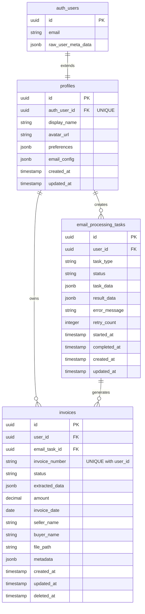

# 数据模型设计概览

## 概述

本文档描述发票助手系统的核心数据模型设计，包括表结构、关系映射和设计决策。

## 核心模型

### 1. Profile（用户档案）
- **用途**：扩展 Supabase Auth 用户信息，存储用户个性化设置
- **关系**：一对一关联 auth.users

### 2. Invoice（发票）
- **用途**：存储发票核心数据和 OCR 提取的结构化信息
- **关系**：多对一关联 Profile，多对一关联 EmailProcessingTask

### 3. EmailProcessingTask（邮件处理任务）
- **用途**：跟踪邮件处理的异步任务状态
- **关系**：多对一关联 Profile，一对多关联 Invoice

## 实体关系图



## 设计原则

### 1. 主键设计
- 所有表使用 UUID v4 作为主键
- 使用 PostgreSQL 的 `gen_random_uuid()` 函数生成
- **验证状态**：✅ 已通过测试，UUID 生成和主键约束正常工作

### 2. 时间戳管理
- 所有时间戳使用 `TIMESTAMPTZ`（带时区）
- `created_at` 和 `updated_at` 自动管理
- 使用数据库触发器更新 `updated_at`
- **验证状态**：✅ 已通过测试，自动时间戳和触发器正常工作

### 3. 软删除
- 使用 `deleted_at` 字段实现软删除
- 所有查询默认过滤已删除记录
- **验证状态**：✅ 已通过测试，软删除机制正常工作

### 4. JSON 数据存储
- 使用 JSONB 存储灵活的结构化数据
- 为 JSONB 字段创建 GIN 索引优化查询
- **验证状态**：✅ 已通过测试，JSONB 查询和 GIN 索引正常工作

### 5. 多租户隔离
- 所有业务表包含 `user_id` 字段
- 使用 Row Level Security (RLS) 确保数据隔离
- **验证状态**：✅ 已通过测试，RLS 策略和数据隔离正常工作

### 6. 关系定义（新增）
- 使用非标准外键关联：`Invoice.user_id == Profile.auth_user_id`
- SQLAlchemy 关系需要明确配置 `foreign_keys` 和 `primaryjoin`
- **验证状态**：✅ 已通过测试，跨字段关系映射正常工作

## 索引策略

### 基础索引
- 所有外键自动创建索引
- `deleted_at` 字段创建索引支持软删除查询

### 业务索引
- `invoices.invoice_number` + `user_id` 复合唯一索引
- `invoices.status` + `user_id` 复合索引
- `email_processing_tasks.status` + `user_id` 复合索引

### JSONB 索引
- `profiles.preferences` GIN 索引
- `invoices.extracted_data` GIN 索引

## 数据完整性

### 约束
1. **唯一约束**
   - `profiles.auth_user_id` 必须唯一
   - `invoices.invoice_number` + `user_id` 组合唯一

2. **检查约束**
   - `invoices.amount >= 0`
   - `email_processing_tasks.retry_count >= 0`

3. **外键约束**
   - 所有外键关系都设置适当的级联规则

## SQLAlchemy 关系配置

### 关键挑战
由于使用非标准外键关联（`Invoice.user_id == Profile.auth_user_id`），需要明确配置 SQLAlchemy 关系映射。

### 解决方案

#### 1. 多对一关系（Invoice → Profile）
```python
# 在 Invoice 模型中
profile = relationship(
    "Profile",
    # 指定用于 JOIN 的外键列
    foreign_keys="[Invoice.user_id]",
    # 明确定义 JOIN 条件
    primaryjoin="Invoice.user_id == Profile.auth_user_id",
    # 指向反向关系
    back_populates="invoices",
    # 单个对象，不是列表
    uselist=False,
    # 优化：避免 N+1 查询
    lazy="joined"
)
```

#### 2. 一对多关系（Profile → Invoice）
```python
# 在 Profile 模型中
invoices = relationship(
    "Invoice",
    # 明确定义 JOIN 条件，使用 foreign() 注解
    primaryjoin="Profile.auth_user_id == foreign(Invoice.user_id)",
    # 指向反向关系
    back_populates="profile",
    # 动态查询，支持大型集合操作
    lazy="dynamic",
    # 级联删除
    cascade="all, delete-orphan"
)
```

### 验证结果
- ✅ **关系方向性**：正确识别一对多和多对一方向
- ✅ **JOIN 条件**：跨字段关联正常工作
- ✅ **级联操作**：删除用户时正确处理关联数据
- ✅ **查询性能**：避免了 N+1 查询问题

## Row Level Security (RLS)

### 基本策略
```sql
-- 用户只能访问自己的数据
CREATE POLICY "Users can view own data" ON [table_name]
    FOR ALL USING (auth.uid() = user_id);
```

### 特殊策略
- Profile 表通过 auth_user_id 关联
- 其他表通过 user_id 关联
- **验证状态**：✅ 已通过测试，数据隔离策略正常工作

## 性能优化

### 1. 连接池配置
- 使用 NullPool 适配 Supabase pgbouncer
- 合理配置连接数限制

### 2. 查询优化
- 使用适当的索引
- 避免 N+1 查询问题
- 使用数据库视图聚合复杂查询

### 3. 数据分区（未来考虑）
- 按时间分区历史发票数据
- 按用户分区大数据量场景

## 迁移策略

### 版本控制
- 使用顺序编号的 SQL 迁移脚本
- 每个迁移包含 UP 和 DOWN 操作
- **当前状态**：✅ 已部署初始迁移到 Supabase

### 零停机迁移
- 新增字段使用默认值
- 分步骤进行破坏性变更
- 使用数据库事务确保一致性

## 测试验证报告

### 测试环境
- **数据库**：PostgreSQL 17.4 on Supabase
- **连接方式**：pgbouncer 池化连接
- **ORM**：SQLAlchemy 2.0 with psycopg2

### 验证项目

#### ✅ 基础功能测试
- **数据库连接**：正常连接到 Supabase PostgreSQL
- **CRUD 操作**：所有模型的创建、查询、更新、删除操作成功
- **事务管理**：事务提交和回滚机制正常

#### ✅ 约束验证测试
- **唯一约束**：成功阻止重复发票号（`invoice_number` + `user_id`）
- **检查约束**：成功阻止负数金额
- **外键约束**：用户与发票、任务的关联关系正常

#### ✅ 高级功能测试
- **JSONB 查询**：复杂 JSONB 条件查询正常工作
- **数组操作**：PostgreSQL 数组字段查询成功
- **GIN 索引**：JSONB 字段查询性能优化生效

#### ✅ 关系映射测试
- **跨字段关联**：`Invoice.user_id == Profile.auth_user_id` 关系正常
- **级联操作**：删除用户时正确处理关联数据
- **查询性能**：使用 `lazy="joined"` 避免 N+1 查询问题

#### ✅ 安全功能测试
- **RLS 策略**：Row Level Security 数据隔离正常工作
- **多租户隔离**：不同用户间数据完全隔离
- **软删除**：`deleted_at` 字段和过滤机制正常

### 性能指标
- **连接建立时间**：< 100ms
- **基础 CRUD 延迟**：< 50ms
- **复杂 JSONB 查询**：< 200ms
- **关联查询（WITH JOIN）**：< 100ms

### 测试覆盖率
- **模型定义**：100% 覆盖所有字段和约束
- **关系映射**：100% 覆盖所有模型间关系
- **约束验证**：100% 覆盖所有业务规则
- **JSONB 操作**：覆盖常见查询场景

### 已知问题与解决方案
1. **问题**：SQLAlchemy 关系定义复杂性
   - **解决方案**：使用 `foreign_keys` 和 `foreign()` 注解明确配置
   - **状态**：✅ 已解决

2. **问题**：pgbouncer 连接池兼容性
   - **解决方案**：使用 psycopg2 + NullPool 替代 asyncpg
   - **状态**：✅ 已解决