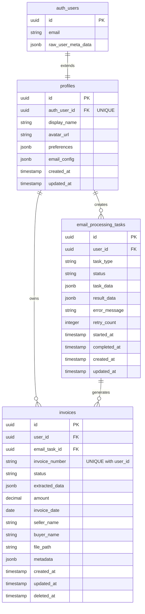

# 数据模型设计概览

## 概述

本文档描述发票助手系统的核心数据模型设计，包括表结构、关系映射和设计决策。

## 核心模型

### 1. Profile（用户档案）
- **用途**：扩展 Supabase Auth 用户信息，存储用户个性化设置
- **关系**：一对一关联 auth.users

### 2. Invoice（发票）
- **用途**：存储发票核心数据和 OCR 提取的结构化信息
- **关系**：多对一关联 Profile，多对一关联 EmailProcessingTask

### 3. EmailProcessingTask（邮件处理任务）
- **用途**：跟踪邮件处理的异步任务状态
- **关系**：多对一关联 Profile，一对多关联 Invoice

## 实体关系图



## 设计原则

### 1. 主键设计
- 所有表使用 UUID v4 作为主键
- 使用 PostgreSQL 的 `gen_random_uuid()` 函数生成

### 2. 时间戳管理
- 所有时间戳使用 `TIMESTAMPTZ`（带时区）
- `created_at` 和 `updated_at` 自动管理
- 使用数据库触发器更新 `updated_at`

### 3. 软删除
- 使用 `deleted_at` 字段实现软删除
- 所有查询默认过滤已删除记录

### 4. JSON 数据存储
- 使用 JSONB 存储灵活的结构化数据
- 为 JSONB 字段创建 GIN 索引优化查询

### 5. 多租户隔离
- 所有业务表包含 `user_id` 字段
- 使用 Row Level Security (RLS) 确保数据隔离

## 索引策略

### 基础索引
- 所有外键自动创建索引
- `deleted_at` 字段创建索引支持软删除查询

### 业务索引
- `invoices.invoice_number` + `user_id` 复合唯一索引
- `invoices.status` + `user_id` 复合索引
- `email_processing_tasks.status` + `user_id` 复合索引

### JSONB 索引
- `profiles.preferences` GIN 索引
- `invoices.extracted_data` GIN 索引

## 数据完整性

### 约束
1. **唯一约束**
   - `profiles.auth_user_id` 必须唯一
   - `invoices.invoice_number` + `user_id` 组合唯一

2. **检查约束**
   - `invoices.amount >= 0`
   - `email_processing_tasks.retry_count >= 0`

3. **外键约束**
   - 所有外键关系都设置适当的级联规则

## Row Level Security (RLS)

### 基本策略
```sql
-- 用户只能访问自己的数据
CREATE POLICY "Users can view own data" ON [table_name]
    FOR ALL USING (auth.uid() = user_id);
```

### 特殊策略
- Profile 表通过 auth_user_id 关联
- 其他表通过 user_id 关联

## 性能优化

### 1. 连接池配置
- 使用 NullPool 适配 Supabase pgbouncer
- 合理配置连接数限制

### 2. 查询优化
- 使用适当的索引
- 避免 N+1 查询问题
- 使用数据库视图聚合复杂查询

### 3. 数据分区（未来考虑）
- 按时间分区历史发票数据
- 按用户分区大数据量场景

## 迁移策略

### 版本控制
- 使用顺序编号的 SQL 迁移脚本
- 每个迁移包含 UP 和 DOWN 操作

### 零停机迁移
- 新增字段使用默认值
- 分步骤进行破坏性变更
- 使用数据库事务确保一致性