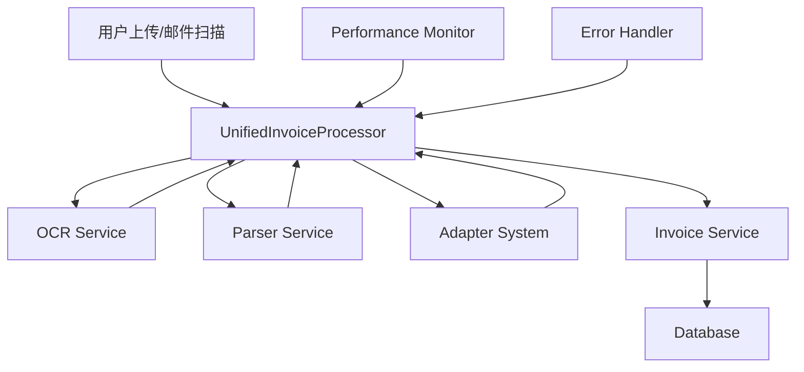

# 统一发票处理架构文档

## 1. 概述

统一发票处理架构旨在整合手动上传和邮件自动化两种发票处理流程，确保数据的一致性和系统的可维护性。

## 2. 架构设计

### 2.1 核心组件



### 2.2 组件职责

#### UnifiedInvoiceProcessor（统一处理器）
- **职责**: 协调整个发票处理流程
- **功能**:
  - 单文件处理 (`process_single_file`)
  - 批量文件处理 (`process_batch_files`)
  - 错误处理和重试机制
  - 性能监控集成

#### OCR Service（OCR 服务）
- **职责**: 识别 PDF 中的文本和结构化数据
- **特性**:
  - 支持多种发票类型
  - 返回置信度分数
  - 验证功能

#### Parser Service（解析服务）
- **职责**: 从原始 OCR 数据中提取结构化字段
- **功能**:
  - 字段提取
  - 数据清洗
  - 格式标准化

#### Adapter System（适配器系统）
- **职责**: 将不同类型的发票数据转换为统一格式
- **支持类型**:
  - 增值税发票
  - 火车票
  - 机票行程单
  - 通用发票

#### Field Mapping（字段映射）
- **职责**: 处理字段名的转换和数据路径标准化
- **功能**:
  - camelCase 到 snake_case 转换
  - 多路径数据访问支持
  - 字段合并和去重

## 3. 数据流

### 3.1 处理流程

```
1. 文件输入
   ├── 手动上传 → API 端点
   └── 邮件附件 → 自动扫描

2. OCR 识别
   ├── 调用 OCR 服务
   ├── 获取原始数据
   └── 重试机制（3次）

3. 数据解析
   ├── 提取结构化字段
   ├── 应用适配器转换
   └── 字段映射标准化

4. 发票创建
   ├── 构建标准数据结构
   ├── 保存到数据库
   └── 处理重复发票

5. 结果返回
   ├── 成功：返回发票信息
   └── 失败：返回错误详情
```

### 3.2 数据结构

#### 输入数据
```python
{
    "file_path": str,
    "user_id": UUID,
    "source": InvoiceSource,  # UPLOAD 或 EMAIL
    "source_metadata": dict   # 可选的元数据
}
```

#### 处理后的数据
```python
{
    "success": bool,
    "invoice_id": str,
    "invoice_number": str,
    "invoice_type": str,
    "is_new": bool,
    "data": {
        # 标准化的发票数据
        "invoice_number": str,
        "invoice_date": str,
        "total_amount": str,
        "seller_name": str,
        "buyer_name": str,
        # 商品明细（多路径访问）
        "items": list,
        "invoice_items": list,
        "invoice_details": list,
        "invoiceDetails": list,
        "commodities": list
    },
    "validation": dict,  # 验证信息
    "confidence": float  # 置信度
}
```

## 4. 错误处理

### 4.1 错误类型

| 错误类型 | 说明 | 处理方式 |
|---------|------|----------|
| `OCRError` | OCR 识别失败 | 重试 3 次，返回错误 |
| `DataParsingError` | 数据解析失败 | 返回部分数据 |
| `DuplicateInvoiceError` | 发票重复 | 返回现有发票信息 |
| `ProcessingError` | 通用处理错误 | 记录日志，返回错误 |

### 4.2 重试策略

```python
# OCR 服务重试
- 重试次数：3
- 退避策略：指数退避 (2^n 秒)
- 超时处理：单次请求 30 秒
```

## 5. 性能优化

### 5.1 并发处理
- 批量处理默认并发数：3
- 使用信号量控制并发
- 异步 I/O 操作

### 5.2 性能监控
- 操作耗时跟踪
- 内存使用监控
- 成功率统计
- 性能告警机制

### 5.3 性能指标
- 平均处理时间：< 5 秒
- P99 处理时间：< 10 秒
- 成功率目标：> 95%
- 内存使用：< 500MB

## 6. API 接口

### 6.1 统一处理端点

**端点**: `POST /api/v1/invoices/create-with-file-unified`

**请求参数**:
- `file`: 发票 PDF 文件（必需）
- `invoice_data`: 发票数据 JSON（可选）
- `auto_extract`: 是否自动提取（默认 true）

**响应格式**:
```json
{
    "success": true,
    "invoice_id": "uuid",
    "invoice_number": "INV001",
    "invoice_type": "增值税专用发票",
    "is_new": true,
    "data": {},
    "validation": {},
    "confidence": 0.95,
    "message": "发票创建成功"
}
```

### 6.2 兼容性说明

原有端点 `/api/v1/invoices/create-with-file` 保持可用，但建议迁移到统一端点。

## 7. 集成指南

### 7.1 前端集成

```javascript
// 使用统一端点上传发票
const formData = new FormData();
formData.append('file', pdfFile);
formData.append('auto_extract', 'true');

const response = await fetch('/api/v1/invoices/create-with-file-unified', {
    method: 'POST',
    headers: {
        'Authorization': `Bearer ${token}`
    },
    body: formData
});
```

### 7.2 邮件自动化集成

```python
# 在 AutomatedInvoiceProcessor 中
unified_processor = UnifiedInvoiceProcessor(db)
result = await unified_processor.process_batch_files(
    file_paths=pdf_files,
    user_id=user_id,
    source=InvoiceSource.EMAIL,
    source_metadata=metadata
)
```

## 8. 故障排除

### 8.1 常见问题

**问题 1**: 商品明细不显示
- **原因**: 前端使用了未映射的字段路径
- **解决**: 确保使用标准路径之一（items, invoice_items 等）

**问题 2**: OCR 超时
- **原因**: 文件过大或 OCR 服务响应慢
- **解决**: 检查文件大小，优化 OCR 服务配置

**问题 3**: 重复发票错误
- **原因**: 相同发票号已存在
- **解决**: 检查错误响应中的 existing_invoice_id

### 8.2 日志查看

```bash
# 查看处理日志
tail -f logs/unified_processor.log

# 查看性能日志
ls monitoring/metrics/

# 查看错误告警
grep "ERROR" logs/unified_processor.log
```

## 9. 最佳实践

### 9.1 错误处理
- 始终检查响应的 `success` 字段
- 处理各种错误类型
- 为用户提供清晰的错误信息

### 9.2 性能优化
- 批量处理时使用合理的并发数
- 监控内存使用情况
- 定期查看性能报告

### 9.3 数据一致性
- 使用事务确保数据完整性
- 验证关键字段的存在性
- 保持向后兼容性

## 10. 未来改进

### 10.1 短期计划
- [x] 修复邮件处理火车票金额为0的问题
- [ ] 添加更多发票类型的适配器
- [ ] 优化 OCR 识别准确率
- [ ] 增强错误恢复机制

### 10.2 长期规划
- [ ] 支持图片格式的发票
- [ ] 实现智能字段匹配
- [ ] 添加机器学习优化

## 11. 最近更新

### 2025-07-22
- **问题修复**: 邮件处理火车票金额为0
  - 原因：邮件处理模块未使用统一发票处理器
  - 解决：修改 `email_processing.py` 使用 `UnifiedInvoiceProcessor`
  - 详情：参见 [bugfix_email_train_ticket_amount.md](./bugfix_email_train_ticket_amount.md)

## 附录

### A. 配置参数

| 参数 | 默认值 | 说明 |
|-----|-------|------|
| `MAX_CONCURRENT_JOBS` | 3 | 最大并发处理数 |
| `OCR_RETRY_COUNT` | 3 | OCR 重试次数 |
| `OCR_TIMEOUT` | 30 | OCR 超时时间（秒）|
| `MAX_FILE_SIZE` | 10MB | 最大文件大小 |

### B. 相关文档
- [字段映射说明](./field_mapping_guide.md)
- [适配器开发指南](./adapter_development_guide.md)
- [性能优化指南](./performance_optimization_guide.md)
- [部署验证指南](./deployment_verification.md)