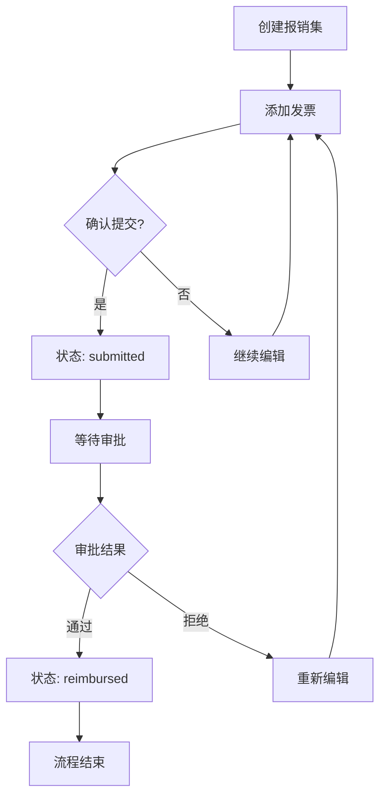
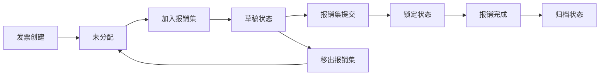

# 报销集状态管理设计文档

## 1. 状态层级结构

### 报销集状态 (ReimbursementSetStatus)
- **草稿 (draft)**: 可编辑状态，允许添加/移除发票
- **已提交 (submitted)**: 锁定状态，不允许修改发票，等待审批
- **已报销 (reimbursed)**: 归档状态，完全只读

### 发票分配状态 (InvoiceAssignmentStatus)
- **未分配**: `reimbursement_set_id = NULL`
- **已分配**: `reimbursement_set_id = <报销集ID>`

## 2. 状态约束规则

### 2.1 报销集状态约束
```sql
-- 状态转换只能单向进行
draft → submitted → reimbursed
-- 不允许逆向转换 (数据一致性保证)
```

### 2.2 发票分配约束
```sql
-- 互斥性约束：一张发票只能属于一个报销集
CONSTRAINT unique_invoice_assignment 
CHECK (reimbursement_set_id IS NULL OR 
       NOT EXISTS (SELECT 1 FROM invoices i2 
                  WHERE i2.id != invoices.id 
                  AND i2.reimbursement_set_id = invoices.reimbursement_set_id))

-- 状态依赖约束：已提交/已报销的报销集中的发票不能被重新分配
CREATE OR REPLACE FUNCTION check_invoice_assignment_status()
RETURNS TRIGGER AS $$
BEGIN
    IF NEW.reimbursement_set_id IS DISTINCT FROM OLD.reimbursement_set_id THEN
        -- 检查原报销集状态
        IF OLD.reimbursement_set_id IS NOT NULL THEN
            IF EXISTS (
                SELECT 1 FROM reimbursement_sets 
                WHERE id = OLD.reimbursement_set_id 
                AND status IN ('submitted', 'reimbursed')
            ) THEN
                RAISE EXCEPTION '无法修改已提交或已报销的报销集中的发票分配';
            END IF;
        END IF;
        
        -- 检查新报销集状态
        IF NEW.reimbursement_set_id IS NOT NULL THEN
            IF EXISTS (
                SELECT 1 FROM reimbursement_sets 
                WHERE id = NEW.reimbursement_set_id 
                AND status IN ('submitted', 'reimbursed')
            ) THEN
                RAISE EXCEPTION '无法向已提交或已报销的报销集中添加发票';
            END IF;
        END IF;
    END IF;
    
    RETURN NEW;
END;
$$ LANGUAGE plpgsql;

CREATE TRIGGER invoice_assignment_status_check
    BEFORE UPDATE ON invoices
    FOR EACH ROW
    EXECUTE FUNCTION check_invoice_assignment_status();
```

## 3. 业务流程设计

### 3.1 报销集生命周期


### 3.2 发票状态联动


## 4. 前端状态管理

### 4.1 BLoC 状态设计
```dart
// 复合状态管理
abstract class ReimbursementSetState extends Equatable {
  // 基础加载状态
  const ReimbursementSetState();
}

// 详情状态 - 包含报销集和相关发票
class ReimbursementSetDetailLoaded extends ReimbursementSetState {
  final ReimbursementSetEntity reimbursementSet;
  final List<InvoiceEntity> invoices;
  final bool isEditable; // 基于状态计算的可编辑性
  
  // 计算属性
  bool get canEdit => reimbursementSet.isDraft;
  bool get canDelete => reimbursementSet.isDraft;
  bool get canSubmit => reimbursementSet.isDraft && invoices.isNotEmpty;
}
```

### 4.2 状态驱动的UI设计
```dart
// 根据状态显示不同的操作按钮
Widget _buildActionButtons() {
  switch (reimbursementSet.status) {
    case ReimbursementSetStatus.draft:
      return Row(children: [
        ElevatedButton(onPressed: _editSet, child: Text('编辑')),
        ElevatedButton(onPressed: _submitSet, child: Text('提交')),
        TextButton(onPressed: _deleteSet, child: Text('删除')),
      ]);
    
    case ReimbursementSetStatus.submitted:
      return Row(children: [
        ElevatedButton(onPressed: _markReimbursed, child: Text('标记已报销')),
        TextButton(onPressed: _viewOnly, child: Text('查看详情')),
      ]);
    
    case ReimbursementSetStatus.reimbursed:
      return ElevatedButton(
        onPressed: _exportReceipt, 
        child: Text('导出报销凭证')
      );
  }
}
```

## 5. 数据一致性保证

### 5.1 原子性操作
```dart
// 创建报销集的原子事务
Future<ReimbursementSetEntity> createReimbursementSet({
  required String setName,
  String? description,
  required List<String> invoiceIds,
}) async {
  return await _supabaseClient.rpc('create_reimbursement_set_atomic', 
    params: {
      'p_set_name': setName,
      'p_description': description,
      'p_invoice_ids': invoiceIds,
    }
  );
}

// 状态转换的原子事务
Future<void> updateSetStatus({
  required String setId,
  required ReimbursementSetStatus newStatus,
}) async {
  // 验证状态转换的合法性
  final currentSet = await getReimbursementSetById(setId);
  if (!_canTransitionTo(currentSet.status, newStatus)) {
    throw StateTransitionException('非法的状态转换');
  }
  
  await _supabaseClient.rpc('update_set_status_atomic', 
    params: {
      'p_set_id': setId,
      'p_new_status': newStatus.value,
      'p_timestamp': DateTime.now().toIso8601String(),
    }
  );
}
```

### 5.2 乐观锁机制
```dart
class ReimbursementSetEntity {
  final int version; // 版本号，用于乐观锁
  
  // 更新时检查版本号
  Future<void> updateWithVersionCheck() async {
    final result = await _supabaseClient
      .from('reimbursement_sets')
      .update({
        'set_name': newName,
        'version': version + 1,
      })
      .eq('id', id)
      .eq('version', version); // 乐观锁检查
      
    if (result.isEmpty) {
      throw ConcurrentModificationException('数据已被其他用户修改');
    }
  }
}
```

## 6. 错误处理和恢复

### 6.1 状态冲突处理
```dart
enum StateConflictType {
  invoiceAlreadyAssigned,    // 发票已被分配
  setStatusChanged,          // 报销集状态已变更
  invoiceModified,           // 发票内容已修改
  concurrentUpdate,          // 并发更新冲突
}

class StateConflictResolver {
  Future<Resolution> resolve(StateConflictType conflict) async {
    switch (conflict) {
      case StateConflictType.invoiceAlreadyAssigned:
        return Resolution.removeConflictingInvoices();
      
      case StateConflictType.setStatusChanged:
        return Resolution.refreshAndPromptUser();
      
      default:
        return Resolution.forceRefresh();
    }
  }
}
```

### 6.2 数据同步和恢复
```dart
// 自动数据修复机制
class DataIntegrityService {
  // 检查并修复数据不一致
  Future<void> repairDataIntegrity() async {
    await _fixOrphanedInvoices();      // 修复孤立发票
    await _recalculateSetTotals();     // 重新计算报销集统计
    await _validateStatusConsistency(); // 验证状态一致性
  }
  
  Future<void> _fixOrphanedInvoices() async {
    // 查找引用了不存在报销集的发票
    final orphans = await _supabaseClient
      .rpc('find_orphaned_invoices');
    
    // 自动清理无效引用
    for (final invoice in orphans) {
      await _supabaseClient
        .from('invoices')
        .update({'reimbursement_set_id': null})
        .eq('id', invoice['id']);
    }
  }
}
```

## 7. 性能优化策略

### 7.1 缓存策略
```dart
class ReimbursementSetCache {
  final Map<String, ReimbursementSetEntity> _setCache = {};
  final Map<String, List<InvoiceEntity>> _invoiceCache = {};
  
  // 智能缓存更新
  void updateCache(ReimbursementSetEntity set) {
    _setCache[set.id] = set;
    
    // 级联更新相关缓存
    if (set.status != _setCache[set.id]?.status) {
      _invalidateRelatedCache(set.id);
    }
  }
  
  // 批量预加载
  Future<void> preloadUserSets(String userId) async {
    final sets = await _repository.getReimbursementSets();
    for (final set in sets) {
      _setCache[set.id] = set;
    }
  }
}
```

### 7.2 增量同步
```dart
class IncrementalSyncService {
  DateTime? _lastSyncTime;
  
  Future<void> syncChanges() async {
    final changes = await _supabaseClient
      .from('reimbursement_sets')
      .select()
      .gte('updated_at', _lastSyncTime?.toIso8601String())
      .order('updated_at');
      
    for (final change in changes) {
      await _processChange(change);
    }
    
    _lastSyncTime = DateTime.now();
  }
}
```

## 8. 监控和调试

### 8.1 状态追踪
```dart
class StateTransitionLogger {
  void logTransition({
    required String setId,
    required ReimbursementSetStatus from,
    required ReimbursementSetStatus to,
    required String userId,
  }) {
    final event = StateTransitionEvent(
      setId: setId,
      fromStatus: from,
      toStatus: to,
      userId: userId,
      timestamp: DateTime.now(),
    );
    
    _analytics.track('reimbursement_set_status_changed', event.toJson());
  }
}
```

### 8.2 状态可视化
```dart
// 开发工具：状态流程图
class StateFlowVisualizer extends StatelessWidget {
  final ReimbursementSetEntity set;
  
  @override
  Widget build(BuildContext context) {
    return Column(children: [
      _buildStatusTimeline(),
      _buildInvoiceStatusGrid(),
      _buildActionHistory(),
    ]);
  }
}
```

这套状态管理设计确保了：
✅ **数据一致性**: 通过数据库约束和事务保证
✅ **业务完整性**: 状态转换规则和验证逻辑
✅ **并发安全**: 乐观锁和冲突检测机制
✅ **用户体验**: 实时反馈和智能操作提示
✅ **系统可维护性**: 清晰的状态机和日志追踪